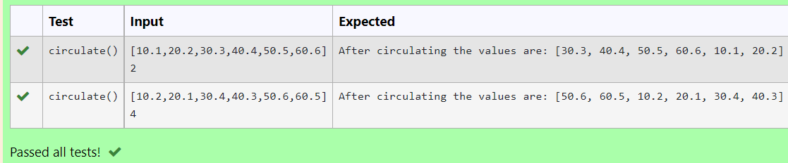

# Circulate-the-values-of-N-variables
## Aim:
To write a python program to circulate the n variables using function concept
## Equipment’s required:
PC
Anaconda - Python 3.7
## Algorithm: 
### Step 1: 
 Get the value from the user
### Step 2: 
 Get the value from the user for the number of rotation
### Step 3: 
Using the slicing concept rotate the list
### Step 4:
End the program
### Step 5: 
### Step 6: 
## Program:
```
Circulate the values of n variables
Name : Soundariyan M N 
Ref : 22008347
```
```python
def circulate():

    a=eval(input())
    n=int(input())
    j=a[n:]+a[:n]
    print("After circulating the values are:",j)
```


## Output:


## Result:
Hence a python program to circulate the n variables using function concept has written successfully.
